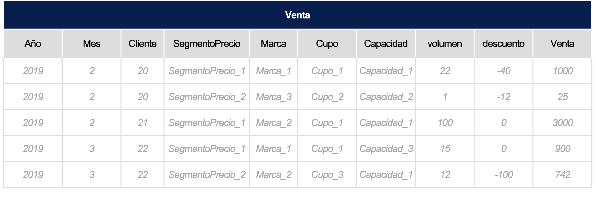

# Reto Colombia

En Bavaria queremos encontrar la mejor estrategia de impulso, mantenimiento o frenado, de un listado de marcas establecido, con el objetivo de ofrecer el mejor portafolio a nuestros puntos de venta/zonas dependiendo de sus características e historial de compra.​

## ¿Qué construir?

El objetivo es encontrar la probabilidad de que un cliente compre cada una de las marcas dadas, con el fin de asignar la estrategia adecuada a cada uno de ellos.​

Para esto deberás crear un modelo que estimé dicha probabilidad para cada una de las 5 marcas que se van a listar.​

## Explicación Datasets

**input1_clientes_estructura.csv** = Tabla de clientes con las características de su punto de venta y ubicación.

- Cliente	: Id del Establecimiento (Llave primaria)
- Regional2: Región donde se encuentra ubicado (Conjunto de departamentos)
- Gerencia2: Gerencia que le distribuye el producto (Conjunto de 1, 2 o mas ciudades)	
- SubCanal2: Tipo de establecimiento: (Tienda, Bar, etc)	
- Categoria: Variable definida por AB-Inbev para calificar la importancia de un establecimiento dada su compra histórica. 	
- Nevera: Variable dummie que me permite ver si el establecimiento tiene o no una nevera en su punto de venta.

**input2_clientes_venta.7z** = Base de historia de compra por marca-cupo-capacidad_envase por establecimiento, de los últimos meses.

- Año: Año en el que se realiza la compra
- Mes: Mes en el que se realiza la compra
- Cliente: Id del establecimiento
- SegmentoPrecio2: Categoría de la marca, dado el ingreso por litro a la compañía.
- Marca2: Marca vendida
- Cupo2: Tipo de envase de la marca vendida
- CapacidadEnvase2: Capacidad en volumen, de la Marca2-Cupo2 vendido.
- Volumen: Cantidad de volumen vendido de la Marca-Cupo2-CapacidadEnvase2
- disc: Descuentos otorgados al establecimiento por la compra
- nr: NetRevenue que dejó la venta a la compañía.

**input3_clientes_test.csv** = Clientes a los que les calculará la probabilidad de compra en octubre de cada una de las marcas dadas (mas adelante), se recibiran solamente los clientes de esta tabla y su score correspondiente para las siguientes marcas: 

> Respetar el orden - **OBLIGATORIO**

1.	Marca1: Marca_20 - Cupo_3 - CapacidadEnvase_9
2.	Marca2: Marca_16- Cupo_2 - CapacidadEnvase_10
3.	Marca3: Marca_9-Cupo_3-CapacidadEnvase_12
4.	Marca_Inno1: Marca_38- Cupo_2 -CapacidadEnvase_10
5.	Marca_Inno2: Marca_39-Cupo_2-CapacidadEnvase_10

## ¿Qué enviar?

1. El output requerido completo.csv​
2. Código completo de la construcción de la solución (únicamente R o Python – no evaluaremos códigos en software comerciales).link de github​
3. Una presentación a detalle de la metodología usada para resolver el problema, el modelo aplicado,  consideraciones y resultados obtenidos. (Máximo 5 diapositivas).​
